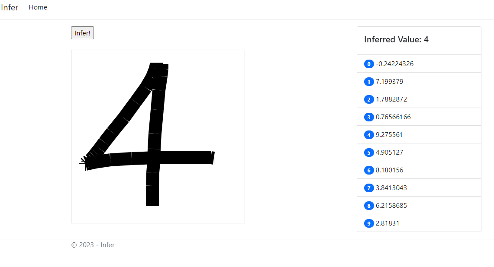

# Overview



## Train


### Python

- venv
```sh
python -m venv venv
source ./venv/Scripts/activate
```

- saving and loading pip packages
```sh
pip freeze > requirements.txt
pip install -r requirements.txt
```
## Infer

install winsdk10

install visual c redistributable
